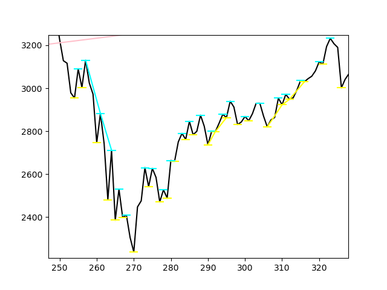

Hoffman is (or more like will be) tool that seeks for stock chart patterns and based on them tries to predict future price movements.
Right now it can:
- scrap data (date, open, close, high, low) of every day (unfortunately I couldn't find any free intraday data source) from yahoo.finance and parse it into original Candlestick class based on which rest of backend is functioning
- visualize that scrapped data as candlestick and line chart
- detect and visualize support and resistance lines
- detect and visualize trend lines
- detect and visualize "fan patterns"

Theory is based on the bible (Technical Analysis Of The Financial Markets by John J. Murphy) and future development of this tool will be based on patterns and principles included in that book.

Example visualization below:

